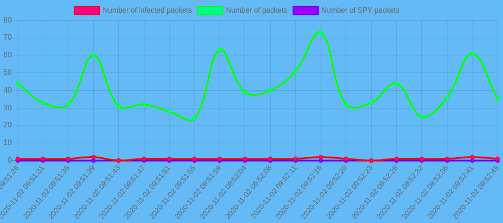
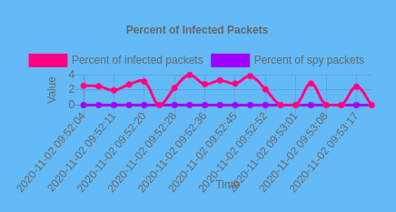

# SmartShark - An IDS with some Machine Learning

The SmartShark project is the fruit of the work of Valentin De Matos and Quentin Fringhian, two Epitech studients managed by the Poc assosiation. The project started in April 2020 and is still in progress.

## What is SmartShark (SmSh) ?

SmartShark is an IDS (Intrusion Detection Systeme) coupled with some machine learning. The main goal of SmSh is to prevent a network from being attacked by a DDOS (Distributed Denial-of-Service) or a MITM (Man In The Midle). A DDOS can shut down a whole network and avoiding it could avoid some shutdowns of your website, while a MITM will spy your conection and steal some important data. It uses the machine learning to learn how does a DDOS looks like and learns to be more efficient when facing one, and has an algoritme to detect MITM attack.

## What tool are we using

We are using `tshark` (Wireshark in CLI) to catch all the traffic that happens on the network.
Once the traffic is captured we pass it through our AI to detect suspicious packets and stopping it from harming the network. 

To build our AI we used `TensorFlow` which is a package use in machine learning to create neural networks. 
In our case we create our own neural network compose by two layers of LSTM and  two layers of Fully connected neurons. 
`LSTM(9)`->
`Dropout(0.3)`->
`LSTM(9)`->
`Dropout(0.3)`->
`Dense(9)`->
`Flatten()`->
`Dense(2)` 

To train our model we need a huge amount of data, for more information, please checkout [this link](https://github.com/PoCInnovation/SmartShark/tree/master/datasets). 
Finally to test our model in real condition we attack our own network with DDoS attack and ARP table for the MIT.

Also, to make SmSh easy to use, we are using `Flask` to create a graphical interface for the user, making our project more accessible to other. 
We are using `Docker` as well, making the installation of SmSh very simple for anyone, because you don't need to download all of SmSh's dependencies yourself.

## How to use it ?

To use SmSh on your computer:

1. You will need to have `Docker` installed
2. Clone our repository
3. Go to the `project` folder
4. Execute the following command `sudo docker build -t smsh:latest .`
5. Execute the following command `sudo docker run --net=host --cap-add=NET_ADMIN -e PUID=1000 -e PGID=1000 -d -p 5000:5000 smsh:latest`

And here you go ! SmSh is ready to be used on your computer !

You will be able to use SmSh with a graphical interface on [this page](http://localhost:5000/).

SmartShark'GUI is composed by three elements.

The first one is your main graph which display all the stats of your network.
You can see in thise exemple in green the amount of packet in your network, in red the amout of suspicious packet (DDoS) and in blue the amount of potential MIT packet. 

The second graph display only the suspicious packets (in percentage) to let you analyze more precisely your network. 

Lastly, you have access to five buttons letting you parameter SmartShark exactly as you need to. 

Here is the list of all available commands:

- `start` -> will make SmSh look into your network and report every bad flow
- `stop` -> will stop SmSh from looking into your network
- `ddos` -> will only check for ddos atack
- `mitm` -> will only check for mitm atack
- `ddos&mitm` -> will check on both

## Authors

[Valentin De Matos](https://github.com/Thytu)

[Quentin Fringhian](https://github.com/QuentinFringhian)

